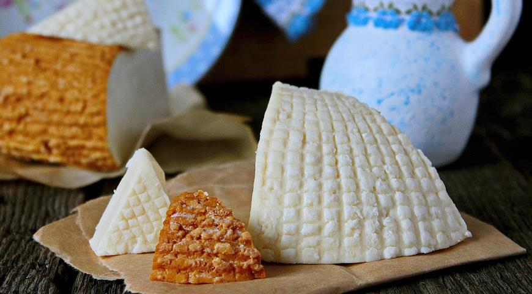

## Ранние поселения

Существуют несколько следов жизни на территории исторического расселения адыгов:

* некоторые халколитические поселения 5000--4000 гг. до н. э.
* майкопская культура 4000--3500 гг. до н. э.
* дольменная культура 3000--2000 гг. до н. э.

См., например, [M. Ivanova (2008) The chronology of the Maikop culture in the Northern Caucasus: changing perspectives](https://www.academia.edu/2543641/The_chronology_of_the_Maikop_culture_in_the_Northern_Caucasus_changing_perspectives)

## Дольмен из долины реки Жане (Wikipedia)

## Средние века
Все средневековье адыги были в тени тюркских (булгар, хазаров, татар) и иранских (алан) племен, которые имели влияние на теретории северо-востока Кавказа.

В средневековье адыги принимали христианство:

* около IV в. от греков (Византия)
* около X в. от грузин

В XV веке началась экспансия Московской Руси в регион. Крымское ханство регулярно устраивала набеги на адыгов и на Московкое княжество, так что они в конце концов объединились и вместе в 1552 году взяли Казань. В 1561 г. Иван Грозный женился на Марии Темрюковне (до крещения Темрыкъуэ Идар ипхъу Гуэщэней). Правда Крымские татары постояли за себя и получали дань от адыгов вплоть до 1700 (Константинопольский договор между Россией и Османской империей). А пока адыги находились под влиянием крымских татар, среди адыгов начали появлятся мусульмане. Согласно трактату 1739 г. между Россией и Османской империей, Кабарда объявлена независимой и должна была служить "барьером между обеими державами". В конце XVIII века появилась и укрепилась Кавказская линия.

## Расселение до Кавказской войны

## Кавказская война (1817--1864)

* В 1798 году на престол Картли-Кахети (Грузия тогда состояла из отдельных княжеств) вступил Георгий XII и просил императора Павла I принять Картли-Кахети под своё покровительство.
* 18 января 1801 года в Петербурге подписан манифест о присоединении Грузии к России. 
* В 1828 году Кази-Мулла провозглашен имамом. Он поднимет знамя газавата против неверных, и дальше начинается череда восстаний.
* В 1830 убыхи и садзы взяли форт в Гагре. Через Чёрное море иностранные шпионы (в основном англичане) распространяли антироссийские настроения и поставляли оружие.
* 7 февраля 1840 г. горцы овладели фортом Лазарев; 29 февраля укрепление Вельяминовское; 23 марта укрепление Михайловское; 1 апреля Николаевский форт
* Но война очень сильно подкосила силы черкесов, плюс контранступления русских в 40-ые годы -- сплошные неудачи черкесов.
* Результат: война против черкесов, массовая депортация и геноцид черексов, абхазов, абазин и убыхов

## Современное расселение черкесов

Диаспоры в Турции, Сирии, Ираке, Израиле...

## Об этнониме

Все адыги называют себя адыгами (*адыгэ*). В советское время началось этническое строительство, так что:

* жители Адыгеи и Краснодарского края --- *адыгейцы*
* жители Карачаево--Черкесии --- *черкесы*
* жители Кабардино--Балкарии --- *кабардинцы*

Иногда к черкесам относят еще и убыхов.

## Язык

Входит в абхазо-адыгскую языковую семью.

* SOV, полисинтетический, эргативное ролевое кодирование
* Можно сделать предикат из всего:

Тэнэ		уы-къы-з-д-и-к1ы-жьы-р?  
где 		2sg.abs-dir-rel.io-loc-loc-идти-re-abs  
Откуда возвращаешься?  

= То, откуда ты сюда идешь назад – это где?

## Письменность

* Черкесы писали еще в XIX веке, используя арабскую графику
* Во время советской стройки национальной идентичности были придуманы алфавиты для адыгейского (Н. Ф. Яковлев и Д. А. Ашхамаф) и кабардино--черкесского языков (Тута Борукаев, реформирован комиссией под руководством Н. Ф. Яковлева).
* адыгские тамги

## Литература

* Нартский эпос
* Шора Бекмурзин Ногмов (1794--1844) --- составил алфавит и грамматику языка, собирал фольклор
* Умар Хапхалович Берсей (1807--1870) --- тоже составил алфавит, автор нескольких басен

> ЖЕНЩИНА И КУРИЦА

> У одной вдовы была одна курица. Каждый день она носила одно золотое яичко. Женщина подумала, что если курице она будет давать корма в два раза больше, то курица будет носить по два золотых яйца в день. Вот и стала женщина так кормить свою курицу. А у курицы лопнул зоб, и она сдохла.

* Султан Хан-Гирей (1808--1842) --- тоже составил алфавит, писал всякие исторические произведения

Достаточно много литературы появилось в советское время.

## Обычаи

> Ввели нас в гостевой дом. На дороге, до прибытия в дом, нас встретили две девушки из этой семьи, одна еще маленькая, а другая --- постарше, повзрослее. Сейчас же взялись за наш багаж. <...> Большинство присутствующих выбритые. Как мне сказали, старики обычно с бородой. Прононс совершенно абхазский. На голове или папаха (низкая), или у некоторых чалма. (Чтобы не позабыть, сейчас мне рассказали: когда верховой гость въезжает во двор, он джигитует, но, уезжая, это – невозможно. Если, уходя, гость стегнет лошадь кнутом, то это значит, что он на хозяина обижен). <...> После того, как нас ввели в дом, пришла, как видно, самая старшая дочь. Все приветствуют нас рукопожатием. Держатся совершенно свободно. Почти у всех симпатичные лица. <...> Во время нашей беседы подошел мужчина средних лет, приветствовал нас. Он долго не садился, Ибрагим его силой усадил. Угостили нас обедом: мелко нарезанное мясо, тушеное на топленом масле, с помидорами. Потом чай. Меня посадили за стол на почетное место (почетным местом считается место у глухой стены). Блюдо первому мне преподнесли, также чай. Хозяин не сел с нами. Он, как видно, пообедал один (в кухонном доме). Оказывается, хозяин никогда не садится за стол вместе с гостем. Кушать начинает гость. Все время старшая дочь хозяина стояла у стены. <...> Здесь тоже подтвердили, насколько строго соблюдаются законы сопровождения: за старшим с левой стороны следует младший; если их трое, то старший находится посередине, следующий – с левой стороны, а младший – с правой; если они вчетвером --- то самый младший опять-таки справа, а остальные, следуя возрасту, опять с левой стороны от старшего; это объясняется тем, что из троих, если необходимо будет кого-то послать по делу, старший пошлет младшего и старый порядок восстановится. Если их четверо, тогда на место посланного по делу младшего, встанет тот, кто занимал место за средним. <...> Она, так же, как и другие, не была предупреждена о нашем посещении и не ждала нас. Девушка была в гостевой комнате и, когда мы вошли во двор, встретила нас. Существует обычай: когда гость заходит во двор, он, по словам Асланбека, не здоровается, его приветствуют только в гостевой комнате: «Пусть будет счастливым твой приход!» После входа в гостевую комнату, женщина знакомится с ним и подает ему руку. При прощании гость подает руку женщине (между прочим, я заметил, что некоторые, в том числе и девушки, подавая руку, сначала берут мой большой палец, а потом всю руку, некоторые же берут мою руку обеими руками).

Симон Джаншиа (1929) Черкесские дневники

## Еда

* адыгейский сыр
* чэтлибж
* бахъсымэ
* лакум

## Танцы, музыка, костюмы

* [Исламей](https://www.youtube.com/watch?v=Y-JfWtts7Fg)
* [Удж](https://www.youtube.com/watch?v=w1TVoHEU_B0)
* [Къафэ](https://www.youtube.com/watch?v=g1x0wUrohJg)
* Хъуромэ
* Зыгъэлъат
* Адыгэ лъэпэч1ас
* Зэфак1у къафэ
* ...

## Кино

* [Руслан Хачемизов (1993) Сумерки надежд](https://ok.ru/video/4417786311)
* [Владимир Битоков (2018) Глубокие реки](https://www.youtube.com/watch?v=5DEarOnJbr4&pbjreload=10)

## Тхьауегъэпсэу!      agricolamz@gmail.com      tinyurl.com/y3donful